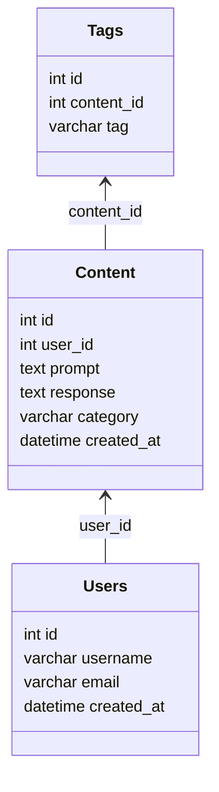

# Content Generator Hub

A web-based application to generate, save, and organize content using the ChatGPT API. This project leverages **SeaORM** for database interactions, **Axum** for API routing, and **Reqwest** for ChatGPT API integration. Designed to be modular with a workspace structure for better organization and scalability.

---

## Features

- **Generate Content**: Input prompts to generate content via ChatGPT.
- **Organize Content**: Categorize and tag generated content.
- **Search and Retrieve**: Query saved content by categories or tags.
- **Scalable Architecture**: Modular structure with separate crates for database, API, and migrations.

---

## Prerequisites

Before starting, ensure you have the following installed:

1. **Rust and Cargo**  
   Install Rust using [rustup](https://rustup.rs/):  
   ```bash
   curl --proto '=https' --tlsv1.2 -sSf https://sh.rustup.rs | sh
   source $HOME/.cargo/env
   ```

2. **SQLite**  
   Install SQLite for the database backend.
   
   On Ubuntu:
   ```bash
   sudo apt install sqlite3
   ```

3. **OpenAI API Key**  
   Sign up at OpenAI to get an API key.

4. **Sea-ORM CLI** 
   Install Sea-ORM CLI for managing database migrations:  
   ```bash
   cargo install sea-orm-cli
   ```
   

## Project Structure

```
content-generator-hub/
├── Cargo.toml             # Workspace configuration
├── db/                    # Sub-crate for database logic
│   ├── Cargo.toml
│   └── src/
├── api/                   # Sub-crate for API logic
│   ├── Cargo.toml
│   └── src/
├── migrations/            # Sub-crate for migrations
│   ├── Cargo.toml
│   └── src/
└── .env                   # Environment variables
```

## Setup Instructions

1. Clone the repository
   ```bash
   git clone <your-repo-url>
   cd content-generator-hub
   ```

2. Configure environment variables  
   Create a `.env` file and fill in the required fields:
   ```
   DATABASE_URL=sqlite://data.db
   CHATGPT_API_KEY=your_openai_api_key
   ```

3. Build the workspace
   ```bash
   cargo build
   ```

4. Run database migrations
   ```bash
   cargo run -p migrations
   ```

5. Start the API server
   ```bash
   cargo run -p api
   ```

## Usage

### Generate Content
Send a POST request to the `/generate` endpoint with a JSON payload:
```json
{
  "prompt": "Write a blog post about Rust programming."
}
```
The API will interact with ChatGPT to generate content and return the response.

### Save Content
Save generated content with categories and tags for future retrieval.

### Search Content
Retrieve saved content by category or tag through query parameters:
```bash
GET /search?category=blog&tag=rust
```

## Database Design


## Learning Objectives

This project will help you:
- Work with SeaORM to model, query, and manage database entities.
- Write database migrations using SeaORM Migration.
- Build RESTful APIs with Axum.
- Integrate with external APIs using Reqwest.
- Structure a Rust project using a modular workspace.
